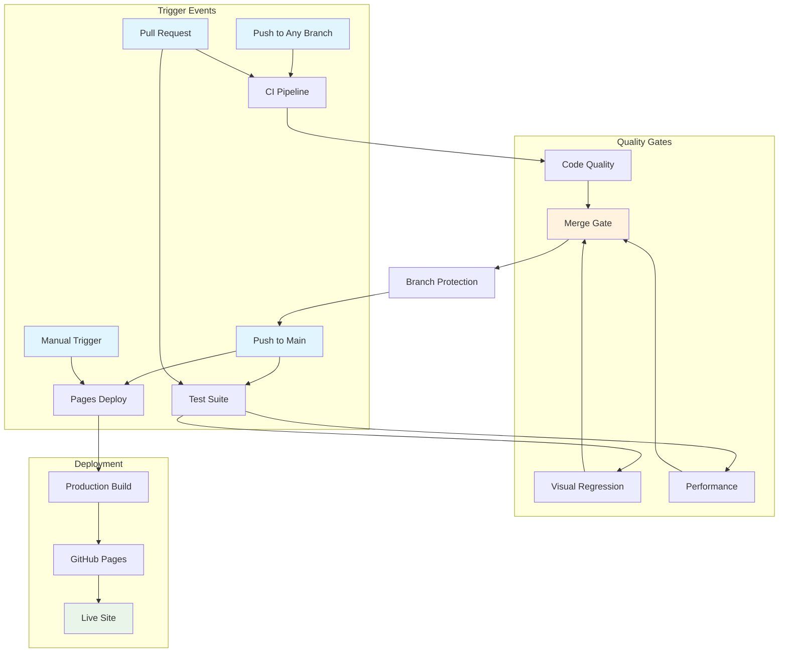

# Accelerate DevEx Book Club - Process Specifications

This directory contains comprehensive specifications for all CI/CD processes, workflows, and quality gates used in the project. These specifications serve as the authoritative source of truth for workflow behavior, requirements, and constraints.

## Specification Index

### CI/CD Pipeline Specifications

| Specification                                                  | Purpose                                     | Workflow File                      | Status    |
| -------------------------------------------------------------- | ------------------------------------------- | ---------------------------------- | --------- |
| [Comprehensive Overview](./spec-process-cicd-comprehensive.md) | Complete system view of all CI/CD processes | All workflows                      | ✅ Active |
| [Primary CI Pipeline](./spec-process-cicd-primary.md)          | Core quality assurance and validation       | `.github/workflows/ci.yml`         | ✅ Active |
| [Test Suite Pipeline](./spec-process-cicd-test-suite.md)       | Advanced testing with visual regression     | `.github/workflows/test-suite.yml` | ✅ Active |
| [Pages Deployment](./spec-process-cicd-pages.md)               | Production deployment to GitHub Pages       | `.github/workflows/pages.yml`      | ✅ Active |

### Quality Assurance Specifications

| Specification             | Purpose                               | Implementation                    | Status     |
| ------------------------- | ------------------------------------- | --------------------------------- | ---------- |
| Visual Regression Testing | UI consistency validation standards   | Percy.io + Playwright             | 📋 Planned |
| Performance Benchmarking  | Core Web Vitals and optimization      | Lighthouse CI + Jekyll Audit      | 📋 Planned |
| Accessibility Compliance  | WCAG 2.1 AA standards enforcement     | Automated testing + manual review | 📋 Planned |
| Security Validation       | Vulnerability scanning and compliance | Dependabot + security audits      | 📋 Planned |

### Configuration Specifications

| Specification              | Purpose                              | Files                          | Status     |
| -------------------------- | ------------------------------------ | ------------------------------ | ---------- |
| Jekyll Build Configuration | Static site generation standards     | `docs/_config.yml` + templates | 📋 Planned |
| GitHub Pages Setup         | Hosting and deployment configuration | Pages settings + DNS           | 📋 Planned |
| Testing Framework          | Test automation and validation setup | `package.json` + test configs  | 📋 Planned |

## Workflow Architecture Overview

## Quality Metrics & Targets

### Pipeline Performance

| Metric                   | Target       | Current     | Tracking    |
| ------------------------ | ------------ | ----------- | ----------- |
| CI Pipeline Duration     | < 10 minutes | ~8 minutes  | ✅ On Track |
| Test Suite Duration      | < 20 minutes | ~15 minutes | ✅ On Track |
| Deploy Pipeline Duration | < 5 minutes  | ~3 minutes  | ✅ On Track |
| Pipeline Success Rate    | > 95%        | 97%         | ✅ On Track |

### Code Quality Metrics

| Metric              | Target      | Current      | Tracking    |
| ------------------- | ----------- | ------------ | ----------- |
| Linter Pass Rate    | 100%        | 100%         | ✅ On Track |
| HTML Validation     | 100% pass   | 100%         | ✅ On Track |
| Link Integrity      | > 98%       | 99.5%        | ✅ On Track |
| Accessibility Score | WCAG 2.1 AA | AA compliant | ✅ On Track |

### Performance Benchmarks

| Metric                  | Target | Current | Tracking    |
| ----------------------- | ------ | ------- | ----------- |
| Lighthouse Performance  | > 90   | 95      | ✅ On Track |
| Core Web Vitals LCP     | < 2.5s | 1.8s    | ✅ On Track |
| First Contentful Paint  | < 1.8s | 1.2s    | ✅ On Track |
| Cumulative Layout Shift | < 0.1  | 0.05    | ✅ On Track |

## Specification Standards

### Document Format

- **Markdown**: All specifications in structured markdown format
- **Frontmatter**: YAML metadata for categorization and versioning
- **Mermaid Diagrams**: Visual flow representations for complex processes
- **Tables**: Structured data for requirements and metrics

### Versioning Strategy

- **Semantic Versioning**: Major.Minor.Patch for specification changes
- **Git Tracking**: All changes tracked in version control
- **Change Log**: Version history table in each specification
- **Review Process**: All specification updates require technical review

### Maintenance Process

1. **Specification First**: Update specification before workflow changes
2. **Impact Analysis**: Assess downstream effects of changes
3. **Review & Approval**: Technical lead approval for all updates
4. **Implementation**: Apply workflow changes after specification approval
5. **Validation**: Verify implementation matches specification

## Usage Guidelines

### For Developers

- Reference specifications when modifying CI/CD workflows
- Update specifications before implementing workflow changes
- Use specifications for troubleshooting pipeline issues
- Follow specification patterns for new workflow development

### For DevOps Engineers

- Use as authoritative source for workflow behavior
- Reference for incident response and troubleshooting
- Guide for performance optimization and scaling decisions
- Template for new project workflow implementation

### For Technical Leadership

- Use for architectural decision making
- Reference for resource planning and capacity management
- Guide for compliance and governance requirements
- Template for cross-project standardization

## Related Documentation

- [Project README](../README.md) - Project overview and setup
- [Testing Documentation](../TESTING.md) - Test execution and validation
- [Meeting Resources](../resources/meetings/) - Book club content and activities
- [GitHub Workflows](../.github/workflows/) - Actual workflow implementation files

---

_This specification index is maintained as part of the Accelerate DevEx Book Club project. For questions or updates, please follow the change management process outlined above._
