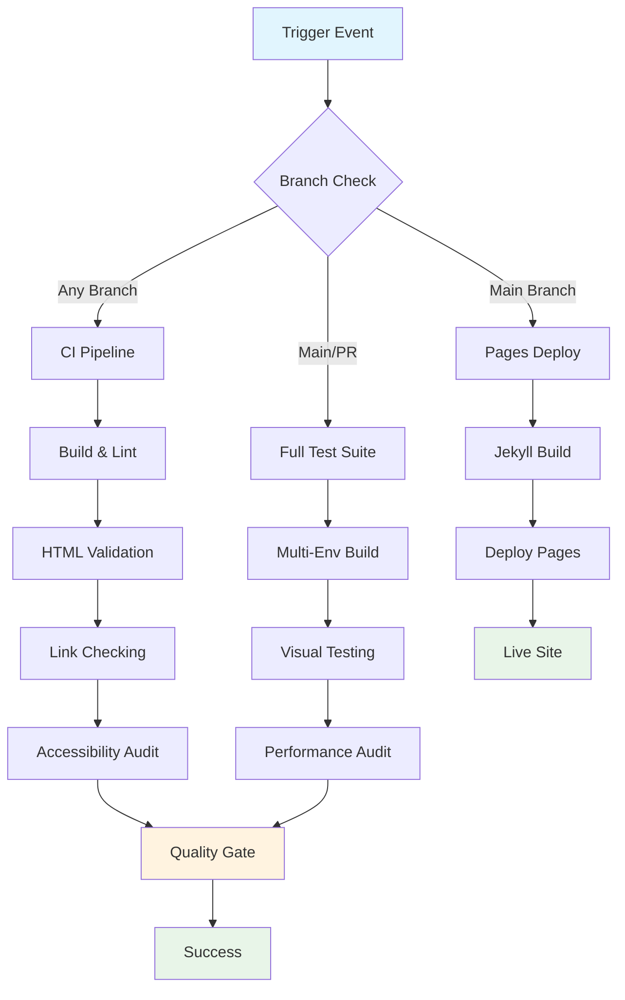

## Workflow Overview

**Purpose**: Provide comprehensive quality assurance, security validation, and automated deployment for Jekyll-based static site with multi-layered testing strategy
**Trigger Events**: Push to any branch, Pull Request to main, Manual workflow dispatch
**Target Environments**: GitHub Pages production, local development validation

## Execution Flow Diagram



## Jobs & Dependencies

| Job Name        | Purpose                                      | Dependencies | Execution Context          |
| --------------- | -------------------------------------------- | ------------ | -------------------------- |
| ci-build-test   | Code quality & validation pipeline           | None         | ubuntu-latest              |
| full-test-suite | Comprehensive testing with visual regression | None         | ubuntu-latest + Playwright |
| pages-build     | Jekyll site build for production             | None         | ubuntu-latest              |
| pages-deploy    | GitHub Pages deployment                      | pages-build  | ubuntu-latest              |

## Requirements Matrix

### Functional Requirements

| ID      | Requirement                       | Priority | Acceptance Criteria                              |
| ------- | --------------------------------- | -------- | ------------------------------------------------ |
| REQ-001 | Multi-language linting validation | High     | CSS, JS, Markdown linters pass without errors    |
| REQ-002 | HTML markup validation            | High     | All generated HTML validates against standards   |
| REQ-003 | Link integrity verification       | High     | All internal/external links resolve successfully |
| REQ-004 | Accessibility compliance          | High     | WCAG 2.1 AA standards met via automated testing  |
| REQ-005 | Visual regression detection       | Medium   | UI changes detected and flagged for review       |
| REQ-006 | Performance benchmarking          | Medium   | Core Web Vitals within acceptable thresholds     |
| REQ-007 | Spell checking validation         | Medium   | Content meets spelling standards                 |

### Security Requirements

| ID      | Requirement                        | Implementation Constraint                  |
| ------- | ---------------------------------- | ------------------------------------------ |
| SEC-001 | Dependency vulnerability scanning  | Automated security audits in CI pipeline   |
| SEC-002 | Secret management isolation        | GitHub secrets for external service tokens |
| SEC-003 | Content Security Policy validation | CSP headers validated in deployment        |

### Performance Requirements

| ID       | Metric               | Target       | Measurement Method      |
| -------- | -------------------- | ------------ | ----------------------- |
| PERF-001 | CI Pipeline Duration | < 10 minutes | Workflow execution time |
| PERF-002 | Site Build Time      | < 2 minutes  | Jekyll build duration   |
| PERF-003 | Page Load Speed      | LCP < 2.5s   | Lighthouse CI auditing  |

## Input/Output Contracts

### Inputs

```yaml
# Environment Variables
PERCY_TOKEN: secret # Purpose: Visual testing service authentication
GITHUB_TOKEN: secret # Purpose: Repository operations and deployments

# Repository Triggers
paths: ['docs/**', '*.md', '.github/**']
branches: ['main', 'feature/**', 'hotfix/**']
events: [push, pull_request, workflow_dispatch]
```

### Outputs

```yaml
# Job Outputs
build_artifact: file # Description: Compiled Jekyll site ready for deployment
test_results: json # Description: Comprehensive test suite results
visual_diffs: images # Description: Visual regression comparison artifacts
performance_report: json # Description: Lighthouse performance metrics
```

### Secrets & Variables

| Type     | Name         | Purpose                                  | Scope      |
| -------- | ------------ | ---------------------------------------- | ---------- |
| Secret   | PERCY_TOKEN  | Visual regression testing authentication | Repository |
| Secret   | GITHUB_TOKEN | Automated deployment and API access      | Workflow   |
| Variable | BASEURL      | Site base URL configuration              | Repository |

## Execution Constraints

### Runtime Constraints

- **Timeout**: 15 minutes maximum per workflow
- **Concurrency**: Pages deployment uses exclusive group locking
- **Resource Limits**: Standard GitHub Actions runner limitations

### Environmental Constraints

- **Runner Requirements**: Ubuntu latest with Ruby 3.1+, Node.js 18+
- **Network Access**: External API calls for spell checking, visual testing
- **Permissions**: Pages write, contents read, id-token write for deployment

## Error Handling Strategy

| Error Type             | Response                   | Recovery Action                         |
| ---------------------- | -------------------------- | --------------------------------------- |
| Build Failure          | Fail fast, detailed logs   | Review Jekyll/SCSS compilation errors   |
| Linting Failure        | Block merge, report issues | Address code quality violations         |
| HTML Validation        | Block deployment           | Fix markup standards compliance         |
| Link Check Failure     | Warning notification       | Update broken internal/external links   |
| Visual Regression      | Manual review required     | Approve changes or fix UI issues        |
| Performance Regression | Warning with metrics       | Optimize assets or code for performance |

## Quality Gates

### Gate Definitions

| Gate             | Criteria                             | Bypass Conditions                       |
| ---------------- | ------------------------------------ | --------------------------------------- |
| Code Quality     | All linters pass (CSS, JS, Markdown) | Never bypassed                          |
| HTML Standards   | W3C validation compliance            | Never bypassed                          |
| Accessibility    | Automated a11y tests pass            | Manual review for false positives       |
| Performance      | Lighthouse score > 90                | Temporary bypass with justification     |
| Visual Integrity | No unexpected UI changes             | Manual approval for intentional changes |

## Monitoring & Observability

### Key Metrics

- **Success Rate**: > 95% pipeline success rate
- **Execution Time**: Mean duration tracking for performance optimization
- **Resource Usage**: Runner minute consumption monitoring

### Alerting

| Condition                        | Severity | Notification Target |
| -------------------------------- | -------- | ------------------- |
| Pipeline Failure > 3 consecutive | High     | Development team    |
| Performance Degradation > 20%    | Medium   | Performance team    |
| Accessibility Violations         | Medium   | Accessibility team  |

## Integration Points

### External Systems

| System              | Integration Type   | Data Exchange           | SLA Requirements |
| ------------------- | ------------------ | ----------------------- | ---------------- |
| Percy.io            | Visual Testing API | Screenshot comparison   | 99% availability |
| GitHub Pages        | Deployment Target  | Static site artifacts   | GitHub SLA       |
| Spell Check Service | Validation API     | Text content validation | Best effort      |

### Dependent Workflows

| Workflow           | Relationship         | Trigger Mechanism     |
| ------------------ | -------------------- | --------------------- |
| Dependabot Updates | Security scanning    | Automated PR creation |
| Release Management | Tag-based deployment | Manual tag creation   |

## Compliance & Governance

### Audit Requirements

- **Execution Logs**: 90-day retention via GitHub Actions history
- **Approval Gates**: Manual review required for visual changes
- **Change Control**: All workflow modifications require PR review

### Security Controls

- **Access Control**: Branch protection rules enforce review requirements
- **Secret Management**: Encrypted secret storage with rotation capability
- **Vulnerability Scanning**: Automated dependency scanning via Dependabot

## Edge Cases & Exceptions

### Scenario Matrix

| Scenario                    | Expected Behavior     | Validation Method             |
| --------------------------- | --------------------- | ----------------------------- |
| External link timeout       | Continue with warning | Log failure, non-blocking     |
| Percy service unavailable   | Skip visual tests     | Graceful degradation          |
| Large file upload           | Build failure         | Asset optimization required   |
| Ruby gem conflicts          | Dependency resolution | Bundle install error handling |
| Node module vulnerabilities | Security alert        | Automated PR for updates      |

## Validation Criteria

### Workflow Validation

- **VLD-001**: All required quality gates execute successfully
- **VLD-002**: Artifact integrity maintained throughout pipeline
- **VLD-003**: Security scanning completes without high/critical findings
- **VLD-004**: Performance benchmarks within acceptable ranges

### Performance Benchmarks

- **PERF-001**: CI pipeline completes within 10-minute SLA
- **PERF-002**: Jekyll build optimization maintains sub-2-minute builds
- **PERF-003**: Visual regression testing scales with UI complexity

## Change Management

### Update Process

1. **Specification Update**: Modify this document first with impact analysis
2. **Review & Approval**: Technical lead and security team approval required
3. **Implementation**: Apply changes to workflow files with testing
4. **Testing**: Validate changes in feature branch before main merge
5. **Deployment**: Merge to main triggers automatic pipeline updates

### Version History

| Version | Date       | Changes                                            | Author             |
| ------- | ---------- | -------------------------------------------------- | ------------------ |
| 1.0     | 2025-01-08 | Initial specification covering all three workflows | Principal Engineer |

## Related Specifications

- [Jekyll Configuration Specification](./spec-config-jekyll.md)
- [GitHub Pages Deployment Specification](./spec-deployment-pages.md)
- [Quality Assurance Testing Specification](./spec-testing-qa.md)
- [Performance Optimization Specification](./spec-performance-optimization.md)
