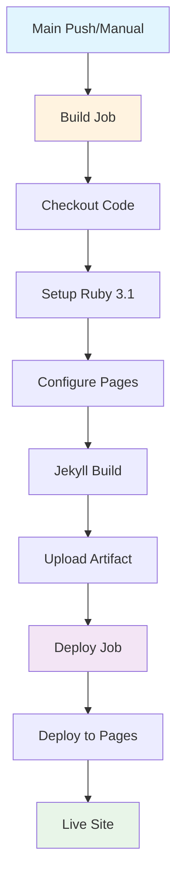

## Workflow Overview

**Purpose**: Automated deployment pipeline for Jekyll site to GitHub Pages production environment
**Trigger Events**: Push to main branch, Manual workflow dispatch
**Target Environments**: GitHub Pages production hosting

## Execution Flow Diagram



## Jobs & Dependencies

| Job Name | Purpose                                          | Dependencies | Environment              |
| -------- | ------------------------------------------------ | ------------ | ------------------------ |
| build    | Jekyll site compilation and artifact preparation | None         | ubuntu-latest            |
| deploy   | GitHub Pages deployment                          | build        | github-pages environment |

## Permission Requirements

### Workflow Permissions

```yaml
permissions:
  contents: read # Repository content access
  pages: write # GitHub Pages deployment
  id-token: write # OIDC token for secure deployment
```

### Concurrency Control

```yaml
concurrency:
  group: 'pages' # Exclusive deployment group
  cancel-in-progress: false # Allow queued deployments
```

## Build Job Specification

### Environment Setup

- **Ruby Version**: 3.1 with automatic bundler caching
- **Working Directory**: `./docs` for Jekyll source
- **Pages Configuration**: Automatic GitHub Pages environment setup

### Build Process

1. **Source Checkout**: Full repository history for build context
2. **Ruby Environment**: Version-pinned setup with dependency caching
3. **Pages Integration**: GitHub Pages action integration for deployment context
4. **Jekyll Compilation**: Site build with production configuration
5. **Artifact Preparation**: Site artifact upload for deployment job

### Build Outputs

```yaml
artifact_name: 'github-pages'
artifact_path: '_site'
retention_days: 1
compression: true
```

## Deploy Job Specification

### Environment Configuration

```yaml
environment:
  name: 'github-pages'
  url: '${{ steps.deployment.outputs.page_url }}'
```

### Deployment Process

- **Artifact Download**: Retrieve build artifact from build job
- **GitHub Pages Deployment**: Official GitHub Pages deployment action
- **URL Output**: Live site URL for verification and integration

## Quality Gates

### Pre-Deployment Validation

- **Build Success**: Jekyll compilation completes without errors
- **Artifact Integrity**: Site artifact properly packaged and uploaded
- **Permission Verification**: Required permissions available for deployment

### Post-Deployment Validation

- **Deployment Success**: Pages deployment completes successfully
- **Site Accessibility**: Deployed site returns successful HTTP responses
- **URL Generation**: Canonical site URL properly generated and accessible

## Error Handling Strategy

| Error Type               | Response                       | Recovery Action                                    |
| ------------------------ | ------------------------------ | -------------------------------------------------- |
| Build Failure            | Block deployment               | Review Jekyll configuration and content errors     |
| Artifact Upload Failure  | Retry with exponential backoff | Check artifact size and network connectivity       |
| Pages Deployment Failure | Manual intervention required   | Review GitHub Pages service status and permissions |
| Permission Denied        | Fail with clear error message  | Verify repository and workflow permissions         |

## Security Considerations

### Access Control

- **Repository Access**: Read-only access to repository contents
- **Pages Access**: Write access limited to Pages deployment only
- **Token Security**: OIDC token used for secure, temporary authentication

### Deployment Safety

- **Branch Protection**: Only main branch can trigger deployment
- **Artifact Validation**: Built artifacts verified before deployment
- **Rollback Capability**: Previous deployment maintained until successful replacement

## Performance Targets

| Metric           | Target       | Measurement                 |
| ---------------- | ------------ | --------------------------- |
| Build Time       | < 2 minutes  | Jekyll compilation duration |
| Deployment Time  | < 30 seconds | Pages deployment completion |
| Site Propagation | < 2 minutes  | Global CDN availability     |
| Total Pipeline   | < 5 minutes  | End-to-end deployment time  |

## Monitoring & Observability

### Deployment Metrics

- **Success Rate**: Track deployment success percentage
- **Duration Trends**: Monitor build and deployment time trends
- **Error Patterns**: Identify common failure modes

### Integration Points

- **GitHub Pages Service**: Dependency on GitHub's Pages infrastructure
- **CDN Propagation**: Global content delivery network synchronization
- **DNS Resolution**: Custom domain configuration if applicable

## Change Management

### Deployment Strategy

- **Direct Deployment**: Immediate replacement of live site
- **Zero-Downtime**: GitHub Pages handles traffic routing during deployment
- **Rollback Process**: Manual revert via repository history if needed

### Version Control

- **Git-based Deployment**: Every deployment tied to specific commit
- **Deployment History**: Full audit trail via GitHub Actions history
- **Change Tracking**: All content changes tracked in git history

## Related Specifications

- [Primary CI Workflow](./spec-process-cicd-primary.md)
- [Test Suite Workflow](./spec-process-cicd-test-suite.md)
- [GitHub Pages Configuration](./spec-config-github-pages.md)
- [Jekyll Build Specification](./spec-build-jekyll.md)
