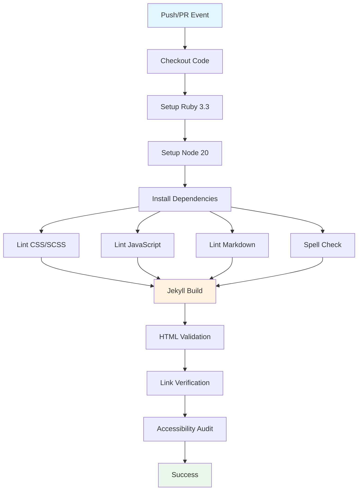

## Workflow Overview

**Purpose**: Primary quality assurance pipeline ensuring code standards and basic validation for all branches
**Trigger Events**: Push to any branch, Pull requests to any branch
**Target Environments**: All branches for quality validation

## Execution Flow Diagram



## Job Definition

| Job Name         | build-and-test                                         |
| ---------------- | ------------------------------------------------------ |
| **Purpose**      | Multi-stage quality validation with fail-fast approach |
| **Runner**       | ubuntu-latest                                          |
| **Timeout**      | 15 minutes                                             |
| **Dependencies** | None (single job pipeline)                             |

## Quality Gates

### Stage 1: Environment Setup

- Ruby 3.3 with Bundler caching
- Node.js 20 with npm dependency installation
- Jekyll gem bundle installation

### Stage 2: Code Quality Validation

- **CSS/SCSS**: Stylelint validation against project rules
- **JavaScript**: ESLint validation including HTML/Markdown embedded JS
- **Markdown**: Markdownlint for content structure and formatting
- **Spelling**: Automated spell checking across content files

### Stage 3: Build & Validation

- **Jekyll Build**: Site compilation with error detection
- **HTML Validation**: W3C standards compliance checking
- **Link Integrity**: HTMLProofer verification of internal/external links
- **Accessibility**: Jekyll Audit for WCAG 2.1 compliance

## Input/Output Contracts

### Environment Requirements

```yaml
ruby_version: '3.3'
node_version: '20'
bundler_cache: true
working_directory: 'docs'
```

### Validation Targets

```yaml
spell_check_paths:
  - 'docs/_posts/**/*.md'
  - 'docs/_pages/**/*.md'
  - 'docs/_meetings/**/*.md'
  - 'docs/index.md'
  - 'README.md'

lint_exclusions:
  - 'docs/vendor/**'
  - 'docs/.jekyll-cache/**'
```

## Error Handling Strategy

| Stage                   | Failure Response    | Recovery Action                         |
| ----------------------- | ------------------- | --------------------------------------- |
| Dependency Installation | Fail fast           | Check package.json/Gemfile syntax       |
| Linting                 | Block merge         | Address code quality violations         |
| Build                   | Fail fast           | Review Jekyll configuration and content |
| HTML Validation         | Block deployment    | Fix markup compliance issues            |
| Link Check              | Report but continue | Update broken links identified          |

## Performance Targets

- **Total Runtime**: < 8 minutes for typical changes
- **Dependency Cache Hit**: > 90% for repeat builds
- **Parallel Execution**: Linters run concurrently where possible

## Related Specifications

- [Test Suite Workflow](./spec-process-cicd-test-suite.md)
- [Pages Deployment Workflow](./spec-process-cicd-pages.md)
