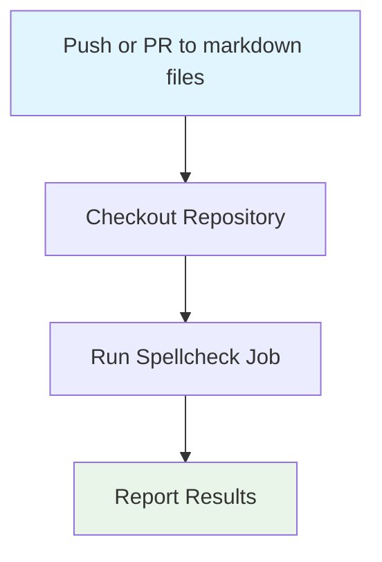

## Workflow Overview

**Purpose**: Automate spellchecking of all markdown content in the repository to ensure documentation quality and accessibility.
**Trigger Events**: Push and pull request affecting any markdown file (`**/*.md`).
**Target Environments**: GitHub-hosted Ubuntu runners.

## Execution Flow Diagram



## Jobs & Dependencies

| Job Name   | Purpose                          | Dependencies | Execution Context    |
| ---------- | -------------------------------- | ------------ | -------------------- |
| spellcheck | Run pyspelling via GitHub Action | checkout     | ubuntu-latest runner |

## Requirements Matrix

### Functional Requirements

| ID      | Requirement                                 | Priority | Acceptance Criteria              |
| ------- | ------------------------------------------- | -------- | -------------------------------- |
| REQ-001 | Spellcheck all markdown files on CI trigger | High     | No spelling errors in job output |
| REQ-002 | Use .spellcheck.yml for config              | High     | Config file is referenced in job |

### Security Requirements

| ID      | Requirement                        | Implementation Constraint |
| ------- | ---------------------------------- | ------------------------- |
| SEC-001 | No secrets required for spellcheck | No secret inputs used     |

### Performance Requirements

| ID       | Metric       | Target      | Measurement Method        |
| -------- | ------------ | ----------- | ------------------------- |
| PERF-001 | Job Duration | < 2 minutes | GitHub Actions job timing |

## Input/Output Contracts

### Inputs

```yaml
# Environment Variables
# None required

# Repository Triggers
paths: ["**/*.md"]
branches: [all]
```

### Outputs

```yaml
# Job Outputs
spellcheck_report: string # Description: Spellcheck results summary
```

### Secrets & Variables

| Type | Name | Purpose | Scope |
| ---- | ---- | ------- | ----- |
| None |      |         |       |

## Execution Constraints

### Runtime Constraints

- **Timeout**: 10 minutes per job
- **Concurrency**: One spellcheck job per workflow run
- **Resource Limits**: Standard GitHub runner limits

### Environmental Constraints

- **Runner Requirements**: Ubuntu-latest
- **Network Access**: GitHub API only
- **Permissions**: Read access to repository

## Error Handling Strategy

| Error Type      | Response        | Recovery Action          |
| --------------- | --------------- | ------------------------ |
| Spellcheck Fail | Mark job failed | Review and fix spelling  |
| Config Missing  | Mark job failed | Add .spellcheck.yml file |

## Quality Gates

### Gate Definitions

| Gate       | Criteria           | Bypass Conditions |
| ---------- | ------------------ | ----------------- |
| Spellcheck | No spelling errors | None              |

## Monitoring & Observability

### Key Metrics

- **Success Rate**: 100% successful runs
- **Execution Time**: < 2 minutes per run
- **Resource Usage**: Standard runner monitoring

### Alerting

| Condition          | Severity | Notification Target |
| ------------------ | -------- | ------------------- |
| Spellcheck Failure | High     | PR status, email    |

## Integration Points

### External Systems

| System | Integration Type | Data Exchange | SLA Requirements |
| ------ | ---------------- | ------------- | ---------------- |
| GitHub | CI/CD            | Status checks | Standard         |

### Dependent Workflows

| Workflow | Relationship | Trigger Mechanism |
| -------- | ------------ | ----------------- |
| None     | N/A          | N/A               |

## Compliance & Governance

### Audit Requirements

- **Execution Logs**: Retained in GitHub Actions for 90 days
- **Approval Gates**: None required
- **Change Control**: Update .spellcheck.yml and workflow spec as needed

### Security Controls

- **Access Control**: GitHub repository permissions
- **Secret Management**: Not applicable
- **Vulnerability Scanning**: Not applicable

## Edge Cases & Exceptions

### Scenario Matrix

| Scenario         | Expected Behavior        | Validation Method      |
| ---------------- | ------------------------ | ---------------------- |
| Missing config   | Job fails, error message | Job log review         |
| Large file count | Job completes, may slow  | Job timing, log review |

## Validation Criteria

### Workflow Validation

- **VLD-001**: Job fails on spelling errors
- **VLD-002**: Job fails if config missing

### Performance Benchmarks

- **PERF-001**: Job completes in < 2 minutes for typical repo

## Change Management

### Update Process

1. **Specification Update**: Modify this document first
2. **Review & Approval**: PR review by DevOps team
3. **Implementation**: Update workflow and config files
4. **Testing**: Run workflow on test branch
5. **Deployment**: Merge to main branch

### Version History

| Version | Date       | Changes               | Author  |
| ------- | ---------- | --------------------- | ------- |
| 1.0     | 2025-09-12 | Initial specification | Copilot |

## Related Specifications

- [Link to markdown lint workflow spec]
- [Link to main CI/CD workflow spec]
