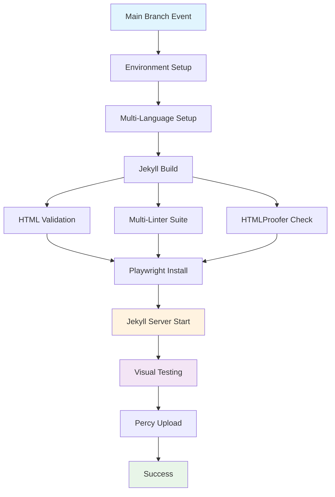

## Workflow Overview

**Purpose**: Comprehensive testing pipeline with visual regression, performance auditing, and advanced quality validation
**Trigger Events**: Push to main branch, Pull requests to main branch
**Target Environments**: Main branch and production-bound changes

## Execution Flow Diagram



## Job Definition

| Job Name         | build-and-test                                                     |
| ---------------- | ------------------------------------------------------------------ |
| **Purpose**      | Advanced testing with visual regression and performance validation |
| **Runner**       | ubuntu-latest                                                      |
| **Timeout**      | 20 minutes                                                         |
| **Dependencies** | None (single comprehensive job)                                    |

## Testing Stages

### Stage 1: Foundation Testing

- **Ruby 3.1** setup with bundle caching
- **Node.js 18** with npm dependency management
- **Jekyll Build** with custom baseurl configuration
- **Standard Linting Suite** (CSS, JS, Markdown)

### Stage 2: Advanced Validation

- **HTML Validation** against W3C standards
- **HTMLProofer** comprehensive link and image validation
- **Playwright Installation** with browser dependencies

### Stage 3: Interactive Testing

- **Jekyll Server** detached mode on port 4000
- **Visual Regression Testing** via Percy service
- **Performance Auditing** with Lighthouse integration

## Secret Dependencies

### Required Secrets

| Secret      | Purpose                                          | Scope      |
| ----------- | ------------------------------------------------ | ---------- |
| PERCY_TOKEN | Visual regression testing service authentication | Repository |

### Service Integrations

- **Percy.io**: Visual diff comparison and baseline management
- **Playwright**: Cross-browser testing automation
- **Lighthouse**: Performance and accessibility auditing

## Quality Gates

### Visual Regression Gate

```yaml
gate_name: 'Visual Integrity'
criteria: 'No unexpected visual changes detected'
bypass_conditions: 'Manual approval for intentional UI changes'
failure_action: 'Block merge until reviewed'
```

### Performance Gate

```yaml
gate_name: 'Performance Standards'
criteria: 'Core Web Vitals within acceptable ranges'
bypass_conditions: 'Temporary degradation with improvement plan'
failure_action: 'Warning with detailed metrics'
```

## Error Handling Strategy

| Error Type                  | Response             | Recovery Action                        |
| --------------------------- | -------------------- | -------------------------------------- |
| Percy Service Unavailable   | Graceful degradation | Skip visual tests, log warning         |
| Jekyll Server Start Failure | Fail fast            | Check port conflicts and configuration |
| Playwright Installation     | Retry with fallback  | Use cached browsers if available       |
| Performance Regression      | Warning notification | Generate performance report            |

## Resource Requirements

### Compute Resources

- **Memory**: Standard runner allocation sufficient
- **Storage**: Temporary browser cache and screenshots
- **Network**: External API calls to Percy service

### Browser Requirements

- **Chromium**: Latest stable for primary testing
- **Firefox**: Latest stable for cross-browser validation
- **WebKit**: Latest stable for Safari compatibility

## Monitoring & Alerts

### Performance Metrics

- **Test Execution Time**: Track duration trends
- **Visual Diff Detection Rate**: Monitor UI stability
- **Service Availability**: Percy and external dependencies

### Alert Conditions

- **Consecutive Failures**: > 3 failures trigger team notification
- **Performance Degradation**: > 20% regression in Core Web Vitals
- **Visual Regression**: Unexpected UI changes require approval

## Related Specifications

- [Primary CI Workflow](./spec-process-cicd-primary.md)
- [Pages Deployment Workflow](./spec-process-cicd-pages.md)
- [Visual Regression Testing Standards](./spec-testing-visual-regression.md)
